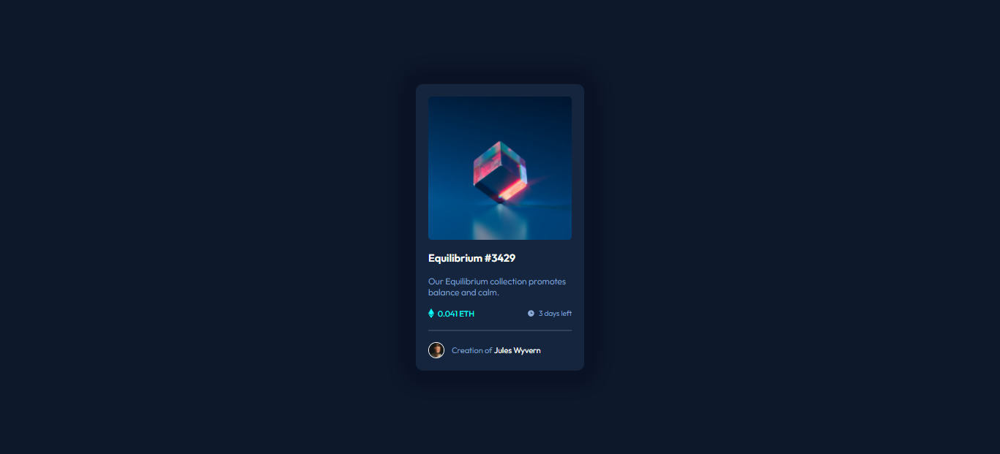

# Frontend Mentor - NFT preview card component solution

This is a solution to the [NFT preview card component challenge on Frontend Mentor](https://www.frontendmentor.io/challenges/nft-preview-card-component-SbdUL_w0U). Frontend Mentor challenges help you improve your coding skills by building realistic projects.

## Overview

### The challenge

Users should be able to:

- View the optimal layout depending on their device's screen size
- See hover states for interactive elements

### Screenshot

### Links

- [Solution URL](https://your-solution-url.com)
- [Live Site URL](https://your-live-site-url.com)

## My process

### Built with

- Semantic HTML5 markup
- CSS custom properties
- Flexbox

### Useful resources

- [Box shadow generator](https://cssgenerator.org/box-shadow-css-generator.html) - I really liked this site as they helped me to generate box shadow easily.
- [Guide To Flexbox](https://css-tricks.com/snippets/css/a-guide-to-flexbox/) - this helps me to understand everything about flexbox, focusing on all the different possible properties.

## Author

- Website - [Yasha-Thakur](https://github.com/Yasha-Thakur)
- Frontend Mentor - [@Yasha-Thakur](https://www.frontendmentor.io/profile/Yasha-Thakur)
